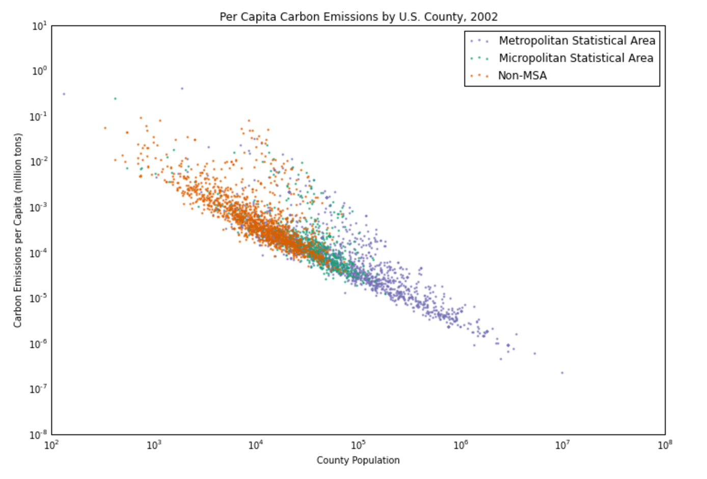

CLARITY: Is easy to read in general I saw the tendency that shows bigger population less carbon emissions per Capita, the quantities are being visualized.
ESTHETIC: The plot communicates, but the colors of Micropolitan S. A. and Metropolitan S. A. are too similar and it makes difficult to separate and understand each kind of area. The scatter plot was a good idea to make the visualization. The graphical choices allow to focus on the right elements.
HONESTY: The plot honestly reproducing the data.

SUGGESTION:My suggestion is just a change in the colors.

